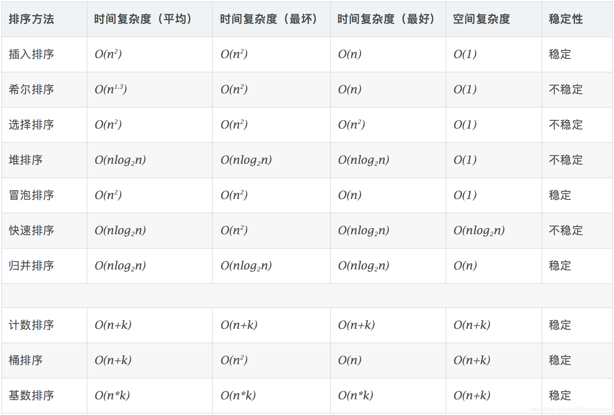
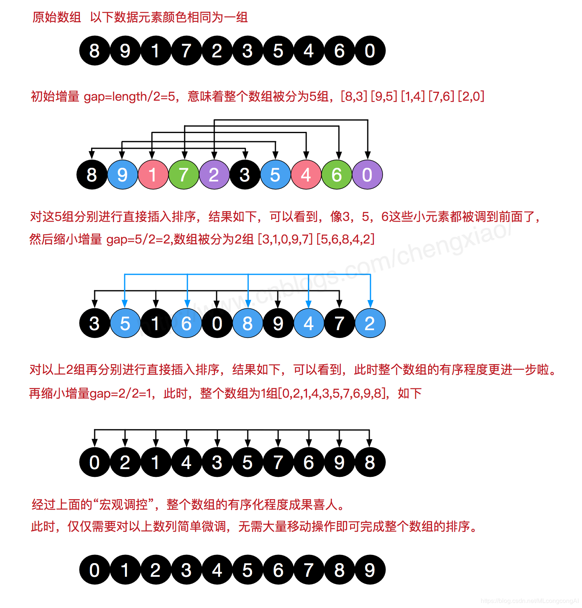

# 排序算法
## 算法概述
### 算法分类
#### 按时间复杂度
1、非线性时间比较类排序：通过比较来决定元素间的相对次序，由于其时间复杂度不能突破O(nlogn)，因此称为非线性时间比较类排序。  
2、线性时间非比较类排序：不通过比较来决定元素间的相对次序，它可以突破基于比较排序的时间下界，以线性时间运行，因此称为线性时间非比较类排序。  
#### 按照排序时元素比较与非比较
1、比较：快速排序、归并排序、堆排序、冒泡排序  
在排序的最终结果里，元素之间的次序依赖于它们之间的比较。每个数都必须和其他数进行比较，才能确定自己的位置。  
2、非比较：计数排序、基数排序、桶排序  
非比较排序是通过确定每个元素之前，应该有多少个元素来排序。针对数组arr，计算arr之前有多少个元素，则唯一确定了arr在排序后数组中的位置。  
    
### 算法复杂度
  
### 总结

## 冒泡排序
冒泡排序是一种简单的排序算法。它重复地走访过要排序的数列，一次比较两个元素，如果它们的顺序错误就把它们交换过来。走访数列的工作是重复地进行直到没有再需要交换，也就是说该数列已经排序完成。这个算法的名字由来是因为越小的元素会经由交换慢慢“浮”到数列的顶端。
### 算法描述
1、比较相邻的元素：如果第一个比第二个大，就交换它们两个；  
2、对每一对相邻元素作同样的工作，从开始第一对到结尾的最后一对，这样在最后的元素应该会是最大的数；  
3、针对所有的元素重复以上的步骤，除了最后一个；  
重复步骤1~3，直到排序完成。  
### 算法分析
#### 排序方式
in-place
#### 时间复杂度
最佳情况：T(n) = O(n)  
最差情况：T(n) = O(n2)  
平均情况：T(n) = O(n2)  
#### 空间复杂度
O(1)
### 图示

### 代码实现
```C++
void bubbleSort(std::vector<int> &rank_list){
    int len = rank_list.size();
    for(int i = 0;i < len - 1;i++){
        for(int j = 0;j < len - i -1;j++){
            if(rank_list[j] > rank_list[j + 1]){
                int temp = rank_list[j];
                rank_list[j] = rank_list[j + 1];
                rank_list[j + 1] = temp;
            }
        }
    }
}
```
## 选择排序
表现最稳定的排序算法之一，因为无论什么数据进去都是O(n2)的时间复杂度，所以用到它的时候，数据规模越小越好。唯一的好处可能就是不占用额外的内存空间了吧。理论上讲，选择排序可能也是平时排序一般人想到的最多的排序方法了。  
选择排序(Selection-sort)是一种简单直观的排序算法。  
工作原理：首先在未排序序列中找到最小（大）元素，存放到排序序列的起始位置，然后，再从剩余未排序元素中继续寻找最小（大）元素，然后放到已排序序列的末尾。以此类推，直到所有元素均排序完毕。  
源于优先级排序：每个元素加入到未排序的列表的时间复杂度O(1)，第一阶段时间复杂度O(n)；第二阶段remove_min操作时间复杂度为O(n2)，总时间复杂度为O(n2)  
### 算法描述
n个记录的直接选择排序可经过n-1趟直接选择排序得到有序结果。具体算法描述如下：  
初始状态：无序区为R[1…n]，有序区为空；  
第i趟排序(i=1,2,3…n-1)开始时，当前有序区和无序区分别为R[1…i-1]和R(i…n）。该趟排序从当前无序区中-选出关键字最小的记录R[k]，将它与无序区的第1个记录R交换，使R[1…i]和R[i+1…n)分别变为记录个数增加1个的新有序区和记录个数减少1个的新无序区；  
n-1趟结束，数组有序化了。  
### 算法分析
#### 排序方式
in-place  
#### 时间复杂度
最佳情况：T(n) = O(n2)  
最差情况：T(n) = O(n2)  
平均情况：T(n) = O(n2)  
#### 空间复杂度
O(1)
### 图示

### 代码实现
```C++
void selectionSort(std::vector<int> &rank_list){
    int len = rank_list.size();
    int min;
    for(int i = 0;i < len - 1;i++){
        min = i;
        for(int j = i + 1;j < len;j++){
            if(rank_list[min] > rank_list[j]){
                min = j;
            }
        }
        int temp = rank_list[min];
        rank_list[min] = rank_list[i];
        rank_list[i] = temp;
    }
}
```
## 插入排序
插入排序（Insertion-Sort）的算法描述是一种简单直观的排序算法。它的工作原理是通过构建有序序列，对于未排序数据，在已排序序列中从后向前扫描，找到相应位置并插入。插入排序在实现上，通常采用in-place排序（即只需用到O(1)的额外空间的排序），因而在从后向前扫描过程中，需要反复把已排序元素逐步向后挪位，为最新元素提供插入空间。  
源于优先级序列：第一阶段是将为排序数据加入到已排序序列中，每次add操作时间复杂度为O(n)，第一阶段的时间复杂度是O(n2)；第二阶段是remove_min操作，时间复杂度是O(n)，总时间复杂度是O(n2)  
### 算法描述
一般来说，插入排序都采用in-place在数组上实现。具体算法描述如下：  
1、从第一个元素开始，该元素可以认为已经被排序；  
2、取出下一个元素，在已经排序的元素序列中从后向前扫描；  
3、如果该元素（已排序）大于新元素，将该元素移到下一位置；  
4、重复步骤3，直到找到已排序的元素小于或者等于新元素的位置；  
5、将新元素插入到该位置；  
6、重复步骤2~5。  
### 算法分析
#### 排序方式
in-place
#### 时间复杂度
最佳情况：T(n) = O(n)  
最坏情况：T(n) = O(n2)  
平均情况：T(n) = O(n2)  
#### 空间复杂度
O(1)
### 图示

### 代码实现
```C++
void insertionSort(std::vector<int> &rank_list){
    int len = rank_list.size();
    for(int i = 1;i < len;i++){
        int temp = rank_list[i];
        int preIndex = i - 1;
        while(preIndex >= 0 && rank_list[preIndex] > temp){
            rank_list[preIndex + 1] = rank_list[preIndex];
            preIndex--;
        }
        rank_list[preIndex + 1] = temp;
    }
}
```
## 希尔排序
希尔排序是希尔（Donald Shell）于1959年提出的一种排序算法。希尔排序也是一种插入排序，它是简单插入排序经过改进之后的一个更高效的版本，也称为缩小增量排序，同时该算法是冲破O(n<sup>2</sup>）的第一批算法之一。它与插入排序的不同之处在于，它会优先比较距离较远的元素。  
希尔排序是把记录按下表的一定增量分组，对每组使用直接插入排序算法排序；随着增量逐渐减少，每组包含的关键词越来越多，当增量减至1时，整个文件恰被分成一组，算法便终止。  
### 算法描述
希尔排序的基本步骤：  
选择增量 ：gap=length/2，缩小增量：gap = gap/2  
增量序列：用序列表示增量选择，{n/2, (n/2)/2, …, 1}  
希尔排序的增量序列的选择与证明是个数学难题，我们选择的这个增量序列是比较常用的，也是希尔建议的增量，称为希尔增量，但其实这个增量序列不是最优的。此处我们做示例使用希尔增量。  
先将整个待排序的记录序列分割成为若干子序列分别进行直接插入排序，具体算法描述：  
1、选择一个增量序列t1，t2，…，tk，其中t<sub>i</sub>>t<sub>j</sub>，t<sub>k</sub>=1；  
2、按增量序列个数k，对序列进行k趟排序；  
3、每趟排序，根据对应的增量ti，将待排序列分割成若干长度为m 的子序列，分别对各子表进行直接插入排序;  
4、仅增量因子为1时，整个序列作为一个表来处理，表长度即为整个序列的长度。 
 
### 算法分析
#### 排序方式
in-place
#### 时间复杂度
最佳情况：T(n) = O(n)  
最坏情况：T(n) = O(n<sup>2</sup>)  
平均情况：T(n) =O(n<sup>1.3</sup>)  
#### 空间复杂度
O(1)
### 图示

### 代码实现
```C++
void shellSort(std::vector<int> &rank_list){
    int len = rank_list.size();
    int gap = len / 2;
    while(gap){
        for(int i = 0;i < gap;i++){
            for(int j = i + gap;j < len;j += gap){
                int temp = rank_list[j];
                int preIndex = j - gap;
                while(preIndex >= 0 && rank_list[preIndex] > temp){
                    rank_list[preIndex + gap] = rank_list[preIndex];
                    preIndex -= gap;
                }
                rank_list[preIndex + gap] = temp;
            }
        }
        gap = gap / 2;
    }
}
```
## 归并排序
归并排序是建立在归并操作上的一种有效的排序算法。该算法是采用分治法（Divide and Conquer）的一个非常典型的应用。将已有序的子序列合并，得到完全有序的序列；即先使每个子序列有序，再使子序列段间有序。若将两个有序表合并成一个有序表，称为2-路归并。  
和选择排序一样，归并排序的性能不受输入数据的影响，但表现比选择排序好的多，因为始终都是O(n·logn)的时间复杂度(稳定)。  
### 算法描述
把长度为n的输入序列分成两个长度为n/2的子序列；  
对这两个子序列分别采用归并排序；  
将两个排序好的子序列合并成一个最终的排序序列。  
### 算法分析
#### 排序方式
out-place
#### 时间复杂度
最佳情况：T(n) = O(nlogn)  
最差情况：T(n) = O(nlogn)  
平均情况：T(n) = O(nlogn)  
#### 空间复杂度
O(n)
### 图示

### 代码实现
```C++
std::vector<int> mergeSort(std::vector<int> rankList){
    int len = rankList.size();
    if(len == 1 || len == 0){
        return rankList;
    }
    else{
        std::vector<int> left,right;
        int mid = len / 2;
        left.assign(rankList.begin(), rankList.begin() + mid);
        right.assign(rankList.begin() + mid, rankList.end());
        return merge(mergeSort(left), mergeSort(right));
    }
}

std::vector<int> merge(std::vector<int> left,std::vector<int> right){
    std::vector<int> result;
    std::vector<int>::iterator iter_left = left.begin();
    std::vector<int>::iterator iter_right = right.begin();
    while(iter_left != left.end() && iter_right != right.end()){
        if(*iter_left > *iter_right){
            result.push_back(*iter_right);
            iter_right++;
        }
        else{
            result.push_back(*iter_left);
            iter_left++;
        }
    }
    while(iter_left != left.end()){
        result.push_back(*iter_left);
        iter_left++;
    }
    while(iter_right != right.end()){
        result.push_back(*iter_right);
        iter_right++;
    }
    return result;
}
```
## 快速排序
快速排序的基本思想：通过一趟排序将待排记录分隔成独立的两部分，其中一部分记录的关键字均比另一部分的关键字小，则可分别对这两部分记录继续进行排序，以达到整个序列有序。  
### 算法描述
快速排序使用分治法来把一个串（list）分为两个子串（sub-lists）。具体算法描述如下：  
1、从数列中挑出一个元素，称为 “基准”（pivot），即枢纽元；  
2、重新排序数列，所有元素比基准值小的摆放在基准前面，所有元素比基准值大的摆在基准的后面（相同的数可以到任一边），在这个分区退出之后，该基准就处于数列的中间位置，称为分区（partition）操作；  
3、递归地（recursive）把小于基准值元素的子数列和大于基准值元素的子数列排序。  
### 算法分析
#### 排序方式
in-place
#### 时间复杂度
最佳情况：T(n) = O(nlogn)  
最差情况：T(n) = O(n<sup>2</sup>)  
平均情况：T(n) = O(nlogn)  
#### 空间复杂度
平均：O(logn)  
最差：O(n)
### 图示

### 代码实现
```C++
void QuickSort(std::vector<int> &rank_list,int p,int r)
{
    int q = 0;
    if(p < r)
    {
        q = Partition(rank_list,p,r);
        QuickSort(rank_list,p,q - 1);
        QuickSort(rank_list,q + 1,r);
    }
}
int Partition(std::vector<int> &rank_list,int p,int r)
{
    int x = rank_list[r];
    int i = p - 1;
    int temp = 0;
    for(int j = p;j < r;j++)
    {
        if(rank_list[j] <= x)
        {
            i++;
            Exchange(rank_list,i,j);
        }
    }
    Exchange(rank_list,i + 1,r);
    return i + 1;

}
void Exchange(std::vector<int> &result,int i,int j)
{
    int temp = result[i];
    result[i] = result[j];
    result[j] = temp;
}
```
## 堆排序
堆排序（Heapsort）是指利用堆这种数据结构所设计的一种排序算法。堆是一个近似完全二叉树的结构，并同时满足堆的性质：即子结点的键值或索引总是小于（或者大于）它的父节点。  
源于优先级序列：第一阶段，add操作整体时间复杂度为O(nlogn)；若第一阶段采用自底而上构建堆，时间复杂度为O(n)；第二阶段remove_min操作整体时间复杂度为O(nlog n)，总体时间复杂度为O(nlogn)。  
### 算法描述
1、将初始待排序关键字序列(R1,R2….Rn)构建成大顶堆，此堆为初始的无序区；  
2、将堆顶元素R[1]与最后一个元素R[n]交换，此时得到新的无序区(R1,R2,……Rn-1)和新的有序区(Rn),且满足R[1,2…n-1]<=R[n]；  
3、由于交换后新的堆顶R[1]可能违反堆的性质，因此需要对当前无序区(R1,R2,……Rn-1)调整为新堆，然后再次将R[1]与无序区最后一个元素交换，得到新的无序区(R1,R2….Rn-2)和新的有序区(Rn-1,Rn)。  
4、不断重复此过程直到有序区的元素个数为n-1，则整个排序过程完成。不断重复此过程直到有序区的元素个数为n-1，则整个排序过程完成。  
### 算法分析
#### 时间复杂度
最佳情况：T(n) = O(nlogn)  
最差情况：T(n) = O(nlogn)  
平均情况：T(n) = O(nlogn)  
#### 空间复杂度
O(1)  
### 图示

### 代码实现
```C++
void heapSort(std::vector<int> &rank_list){
    int len = rank_list.size();
    buildMaxHeap(rank_list);
    for(int i = len - 1;i > 0;i--){
        Exchange(rank_list, 0, i);
        len--;
        heapify(rank_list, 0, len);
    }
}
void buildMaxHeap(std::vector<int> &rankList){
    int len = rankList.size();
    for(int i = len / 2; i>= 0; i--){
        heapify(rankList, i, len);
    }
}
void heapify(std::vector<int> &rank_list, int focus,int len){
    int left = 2 * focus + 1;
    int right = 2 * focus + 2;
    int largest = focus;
    if(left < len && rank_list[left] > rank_list[largest]){
        largest = left;
    }
    if(right < len && rank_list[right] > rank_list[largest]){
        largest = right;
    }
    if(largest != focus){
        Exchange(rank_list, largest, focus);
        heapify(rank_list, largest, len);
    }
}
void Exchange(std::vector<int> &result,int i,int j)
{
    int temp = result[i];
    result[i] = result[j];
    result[j] = temp;
}
```
## 计数排序
计数排序不是基于比较的排序算法，其核心在于将输入的数据值转化为键存储在额外开辟的数组空间中。作为一种线性时间复杂度的排序，计数排序要求输入的数据必须是有确定范围的整数。  
计数排序(Counting sort)是一种稳定的排序算法。计数排序使用一个额外的数组C，其中第i个元素是待排序数组A中值等于i的元素的个数。然后根据数组C来将A中的元素排到正确的位置。它只能对整数进行排序。  
### 算法描述
1、找出待排序的数组中最大和最小的元素；  
2、统计数组中每个值为i的元素出现的次数，存入数组C的第i项；  
3、对所有的计数累加（从C中的第一个元素开始，每一项和前一项相加）；  
4、反向填充目标数组：将每个元素i放在新数组的第C(i)项，每放一个元素就将C(i)减去1。  
### 算法分析
#### 排序方式
out-place
#### 时间复杂度
最佳情况：T(n) = O(n+k)  
最差情况：T(n) = O(n+k)  
平均情况：T(n) = O(n+k)  
#### 空间复杂度
O(K)
### 图示

### 代码实现
```C++
void countingSort(std::vector<int> &rank_list, int max){
    std::vector<int> bucket(max + 1, 0);
    int sortedIndex = 0;
    int len = rank_list.size();
    int bucket_len = max + 1;
    for(int i : rank_list){
        bucket[i]++;
    }
    for(int j = 0;j < bucket_len;j++){
        while(bucket[j]){
            rank_list[sortedIndex++] = j;
            bucket[j]--;
        }
    }
}
```
## 桶排序
桶排序(Bucket sort)是计数排序的升级版。它利用了函数的映射关系，高效与否的关键就在于这个映射函数的确定。  
工作原理：假设输入数据服从均匀分布，将数据分到有限数量的桶里，每个桶再分别排序（有可能再使用别的排序算法或是以递归方式继续使用桶排序进行排序。  
### 算法描述
设置一个BucketSize，作为每个桶所能放置多少个不同数值  
1、设置一个定量的数组当作空桶；  
2、遍历输入数据，并且把数据一个一个放到对应的桶里去；  
3、对每个不是空的桶进行排序；  
4、从不是空的桶里把排好序的数据拼接起来。  
注意，如果递归使用桶排序为各个桶排序，则当桶数量为1时要手动减小BucketSize增加下一循环桶的数量，否则会陷入死循环，导致内存溢出。  
### 算法分析
桶排序最好情况下使用线性时间O(n)，桶排序的时间复杂度，取决与对各个桶之间数据进行排序的时间复杂度，因为其它部分的时间复杂度都为O(n)。很显然，桶划分的越小，各个桶之间的数据越少，排序所用的时间也会越少。但相应的空间消耗就会增大。  
#### 排序方式
out-place  
#### 时间复杂度
最佳情况：T(n) = O(n+k)  
最差情况：T(n) = O(n<sup>2</sup>)  
平均情况：T(n) = O(n+k)  
#### 空间复杂度
O(N+M)
### 图示

### 代码实现
```C++
//桶数量默认为5，桶内排序采用了插入排序
void bucketSort(std::vector<int> & rank_list,int bucket_count = 5){
    if(!rank_list.size()){
        return;
    }
    int max = rank_list[0];
    int min = rank_list[0];
    for(int i : rank_list){
        if(i > max){
            max = i;
        }
        else if(i < min){
            min = i;
        }
        else{
            continue;
        }
    }
    int bucket_size = ((max - min) / bucket_count ) + 1;
    std::vector<std::vector<int>> buckets(bucket_count);
    for(int i : rank_list){
        buckets[(i - min) / bucket_size].push_back(i);
    }
    rank_list.clear();
    for(int i = 0;i < bucket_count;i++){
        insertionSort(buckets[i]);
        for(int j : buckets[i]){
            rank_list.push_back(j);
        }
    }
}
```
## 基数排序
基数排序也是非比较的排序算法，又称卡片排序；  
对每一位进行排序，从最低位开始排序，复杂度为O(kn), n为数组长度，k为数组中的数的最大的位数；  
基数排序是按照低位先排序，然后收集；再按照高位排序，然后再收集；依次类推，直到最高位。  
有时候有些属性是有优先级顺序的，先按低优先级排序，再按高优先级排序。最后的次序就是高优先级高的在前，高优先级相同的低优先级高的在前。  
基数排序基于分别排序，分别收集，所以是稳定的。
### 算法描述
1、取得数组中的最大数，并取得位数;  
2、arr为原始数组，从最低位开始取每个位组成radix数组;  
3、对radix进行计数排序（利用计数排序适用于小范围数的特点）;
MSD:从高位开始进行排序
LSD:从低位开始进行排序  
### 算法分析
#### 排序方式
out-place
#### 时间复杂度
最佳情况：T(n) = O(n\*k)  
最差情况：T(n) = O(n\*k)  
平均情况：T(n) = O(n\*k)  
#### 空间复杂度
O(N+K)
### 图示

### 代码实现
```C++
void radixSort(std::vector<int> &rank_list,int max_digit){
    int mod = 10;
    int dev = 1;
    std::vector<std::vector<int>> bucket(10);
    for(int i = 0;i < max_digit;i++,dev *= 10,mod *= 10){
        for(int j : rank_list){
            bucket[(j % mod) / dev].push_back(j);
        }
        int sortIndex = 0;
        rank_list.clear();
        for(int j = 0;j < 10;j++){
            if(bucket[j].size()){
                for(int k : bucket[j]){
                    rank_list.push_back(k);
                }
                bucket[j].clear();
            }
        }
    }
}
```
